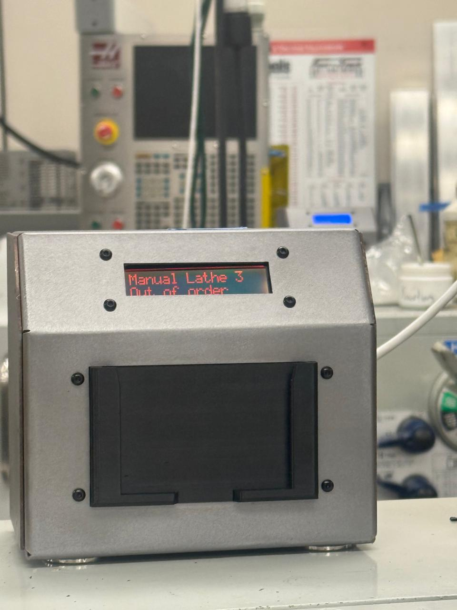

# EMEC Access Management System (EMEC-AMS)

## About

EMEC-AMS is an IoT-driven access management and analytics system designed for the Engineering Manufacturing Education Center at Colorado State University.  
It connects **Raspberry Pi**, **RFID**, **relay**, and **LCD** modules with a **FastAPI** backend and an **Azure MySQL** database to control and track student access to lab machines in real time.

The system authenticates users through RFID cards, grants or denies access, logs every session, and syncs data between a local SQLite database and the cloud for reporting and analysis.

---

## Tech Stack

**Languages and Frameworks**
- Python  
- FastAPI  
- SQL (SQLite + Azure MySQL)

**Hardware**
- Raspberry Pi 4  
- RC522 RFID Reader  
- 16×2 LCD Display  
- Single Relay Module

**Cloud Integration**
- Azure MySQL for centralized data storage and analytics  
- Local SQLite for offline operation and sync recovery

---

## Functions and Features

### Hardware Control
- RFID card authentication for secure user access  
- Relay-based machine power control  
- LCD feedback for machine status and authorization results  

### Data Management
- Local SQLite storage for offline logging  
- Automatic synchronization with Azure MySQL  
- Session tracking and permission verification  

### Reliability and Safety
- Auto recovery on reboot  
- Fault detection and safe session termination  
- Network and sync validation at startup  

### Usability and Insights
- Real-time data updates  
- Clear LCD messages for user feedback  
- Seamless integration with Power BI and analytics dashboards  

---

## ⚙️ Project Media

### Hardware & Prototype Gallery

| Initial Wiring | Inside View | Prototype Assembly |
|----------------|-------------|--------------------|
|  |  |  |

| Second Prototype | Final Setup | System in Action |
|------------------|--------------|------------------|
|  |  |  |

---

### 🎥 Demo Video

**[▶ Watch Demo Video](images/video-working.mp4)**  
A short demonstration of the EMEC Access Management System running in the lab environment, showing live authentication, relay control, and LCD feedback.

---

## What I Built and Learned

- Designed the system architecture and backend logic  
- Built and tested the Python-based integration between RFID, relay, and LCD  
- Implemented data synchronization between SQLite and Azure MySQL  
- Learned end-to-end development including hardware integration, database design, and fault-tolerant deployment  
